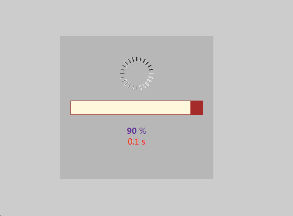
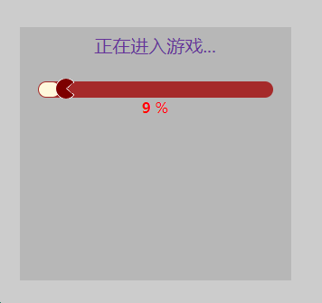

# jQuery.loading
### author [Hans.Wu](http://www.hanswu.com/project/jquery_loading.html "jQuery.loading")
===========================

    一款好用的页面预加载动画插件，用来预加载页面外部文件(图片、音频、视频、样式、javascript)。
    可以通过回调和css样式输出各种各样的动画。
    需要使用者掌握一定的css和js, jquery动画编程能力。

===========================

## 目录
* [准备工作](#准备工作)
* [参数设置](#参数设置)
* [动画效果Demo](#动画效果Demo)

## 准备工作
```
`引入js和css`
<link rel="stylesheet" href="%jspath%/jquery.loading.css" />
<script src="%jspath%/jquery.min.js"></script>
<script src="%jspath%/jquery.loading.min.js"></script>
```
```javascript
`body结束代码前加入js`
$(document).ready(function(){
    $(body).loading();          //此处body可以修改，加载loading动画的DOM
})
```
## 参数设置
```javascript
$(body).loading({
    items: [],                  //加载的文件列表
    loaded: null,               //加载完毕回调函数
    loadingTime: false,         //加载的时间
    loadingPercent: true,       //加载百分比
    loadingAnimate: true,       //加载百分比进度动画，如果为true，默认loading.gif
    loadingImg: false,          //loading动画gif图片
    customAnimate:false,        //用户自定义动画，可以css或js定义
    beforeLoading:null,         //加载开始前调用函数
    cancel:false,               //是否可以取消加载动画，如果可以，连按2次esc键，将取消加载动画。值可以是true或者是定义取消后的回调函数
});
```
```css
.loading-body{}                 /* 加载的外部主体样式 */
.loading-wrapper{}              /* 加载的动画主体样式 */
.loading-inner{}                /* 加载的动画内部显示内容样式 */
.loading-animate-bg{}           /* 加载的动画百分比进度背景样式 */
.loading-animate{}              /* 加载的动画百分比进度样式 */
.loading-img{}                  /* loading动画图片外层div样式 */
.loading-img img{}              /* loading动画图片样式 */
.loading-time{}                 /* 加载的时间显示样式 */
.loading-percent{}              /* 加载百分比显示样式 */
.loading-custom{}               /* 用户自定义动画样式 */
```

## 动画效果Demo
* DEMO1

基本的应用场景
图片页面，预加载一些关键图片，加载完毕再显示页面内容。


```html
<html lang="en">

<head>
  <meta name="viewport" content="width=device-width, initial-scale=1"/>
  <meta http-equiv="Content-Type" content="text/html; charset=utf-8" />
  <meta name="author" content="Hans.Wu, hans.wu@hanswu.com" />
  <title>jQeury.loading Demo1</title>
  <link rel="stylesheet" href="//cdn.bootcss.com/minireset.css/0.0.2/minireset.min.css" />
  <link rel="stylesheet" href="./jquery.loading.css">
  <script src="//cdn.bootcss.com/jquery/1.11.3/jquery.min.js"></script>
</head>

<body>
    <div class="page">

    </div>
    <script src="./jquery.loading.min.js"></script>
    <script>
    $('.page').loading({
        items:[
            "test01.jpg",
            "test02.jpg",
            "test03.jpg",
            "test04.jpg",
            "test05.jpg",
            "test06.jpg",
            "test07.jpg",
            "test08.jpg",
            "test09.jpg",
            "test10.jpg",
        ],
        loadingTime:true,
        loaded:function(){
            alert("loading completed");
        }
    })
    </script>
</body>
```
```css
/*jquery.loading.css*/
.loading-body{
    position: absolute;
    width: 100%;
    height: 100%;
    top: 0;
    left: 0;
    overflow: hidden;
    background: #333;
}
.loading-wrapper{
    position: absolute;
    background-color:#ccc;
    height: 100%;
    height: 100%;
    top: 0;
    left: 0;
    width: 100%;
}
.loading-inner{
    position: absolute;
    width: 300px;
    height: 280px;
    left: 50%;
    top: 50%;
    margin: -140px 0 0 -150px;
    padding: 20px;
    text-align: center;
    background: rgba(0,0,0,.1);
}
.loading-animate-bg{
    background-color: brown;
    height: 28px;
    width: 100%;
    margin-bottom: 20px;
    padding: 1px;
}
.loading-animate{
    height: 26px;
    background-color: cornsilk;
}
.loading-img{margin: 20px 0;}
.loading-time{color:red;}
.loading-percent{color: rebeccapurple;}
.loading-percent span{font-weight: bold;}
```
#####效果图



* DEMO2

给加载过程加些动画效果


```javascript
    $('.page').loading({
        items:[
            "test01.jpg",
            "test02.jpg",
            "test03.jpg",
            "test04.jpg",
            "test05.jpg",
            "test06.jpg",
            "test07.jpg",
            "test08.jpg",
            "test09.jpg",
            "test10.jpg",
        ],
        loadingTime:false,
        loadingImg:"./loading-gif/loading1.gif",
        customAnimate:function(){
            $(".loading-custom").css("line-height",$(".loading-custom").data("percent"));
            $(".loading-img img").css("margin-left",$(".loading-img img").data("percent"));
        },
        loaded:function(){
            alert("loading completed");
        }
    })
```
```css
.loading-body{
    position: absolute;
    width: 100%;
    height: 100%;
    top: 0;
    left: 0;
    overflow: hidden;
    background: #333;
}
.loading-wrapper{
    position: absolute;
    background-color:#ccc;
    height: 100%;
    height: 100%;
    top: 0;
    left: 0;
    width: 100%;
}
.loading-inner{
    position: absolute;
    width: 300px;
    height: 280px;
    left: 50%;
    top: 50%;
    margin: -140px 0 0 -150px;
    padding: 20px;
    text-align: center;
    background: rgba(0,0,0,.1);
}
.loading-animate-bg{
    position:relative;
    background-color: brown;
    height: 18px;
    width: 100%;
    border-radius:9px;
    padding: 1px;
    z-index:10;
    top: 40px;
}
.loading-animate{
    height: 16px;
    border-radius:8px;
    background-color: cornsilk;
}
.loading-img{
    position:absolute;
    z-index: 100;
    width: 100%;
    height: 24px;
    top: -4px;
    left: -4px;
    text-align: left;
    padding: 20px;
    margin-top: 40px;
}
.loading-img img{
position: relative;
}
.loading-percent{color: red; margin-top: 40px;}
.loading-percent span{font-weight: bold;}
.loading-custom{
    position: absolute;
    top: 20px;
    width: 100%;
    left: 0;
    font-size: 20px;
    color: rebeccapurple;
}
.loading-custom:before{
    content: "正在进入游戏...";
}
```
#####效果图



* DEMO3
页面跳转前，预加载下个页面的图片、声音、视频、css、js文件。
```html
<html lang="en">

<head>
  <meta name="viewport" content="width=device-width, initial-scale=1, maximum-scale=1, minimum-scale=1, user-scalable=no">
  <meta http-equiv="Content-Type" content="text/html; charset=utf-8" />
  <meta name="author" content="Hans.Wu, hans.wu@hanswu.com" />
  <title>jQeury.loading Demo3</title>
  <link rel="stylesheet" href="//cdn.bootcss.com/minireset.css/0.0.2/minireset.min.css" />
  <link rel="stylesheet" href="./jquery.loading.css">
  <script src="//cdn.bootcss.com/jquery/1.11.3/jquery.min.js"></script>
</head>

<body>
  <div class="topline"></div>
  <div class="page">
    <a data-href="test.html" href="javascript:;"
    data-preload="test01.jpg,test02.jpg,test03.jpg,test04.jpg,test05.jpg,test06.jpg,test07.jpg,test08.jpg,test09.jpg,test10.jpg,test.css,test.js">
    test</a>
  </div>
  <script src="./jquery.loading.min.js"></script>
  <script>
    $("a[data-preload]").on("click", function() {
      $this = $(this);
      $(".topline").loading({
        items: $this.data("preload").split(","),
        loadingPercent: false,
        loadingAnimate: false,
        loadingImg: false,
        customAnimate: function() {
          $(".loading-custom").width($(".loading-custom").data("percent"));
        },
        cancel: function(){
            alert('取消加载内容');
            //如果取消后还跳转到页面，则
            location.href = $this.data("href");
        },
        loaded: function() {
          location.href = $this.data("href");
        }
      })
    })
  </script>
</body>
</html>
```

```css
.loading-body{
    position: fixed;
    width: 100%;
    height: 10px;
    top: 0;
    left: 0;
}
.loading-wrapper{}
.loading-inner{}
.loading-custom{
    position: absolute;
    left: 0;
    top: 0;
    height: 10px;
    background-color: darkkhaki;
}
```

#####效果图

